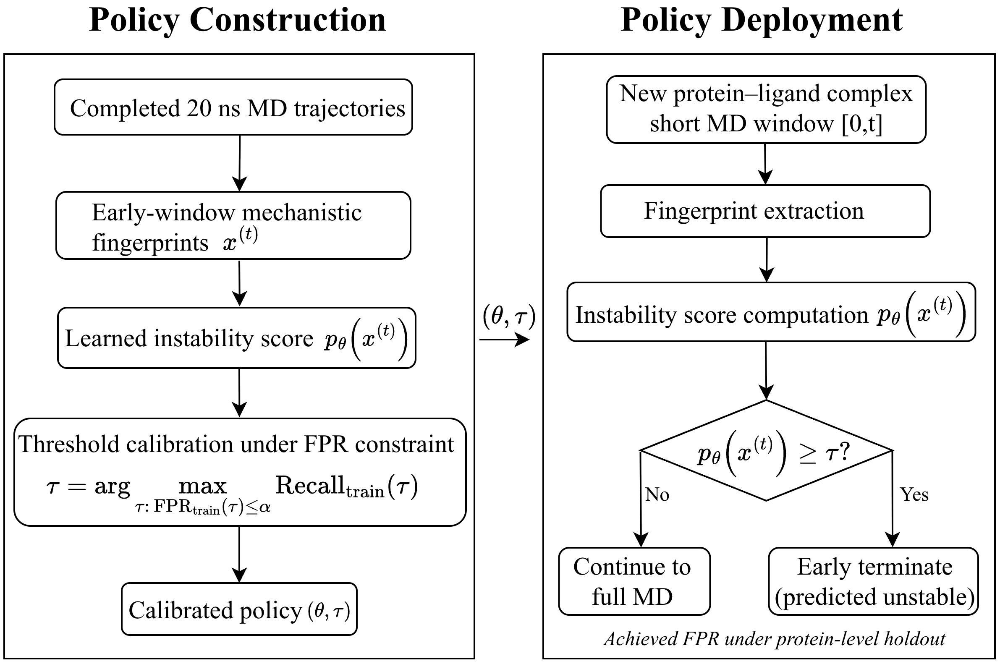

# Risk-Calibrated Early-Termination for MD Screening

This repository contains the reproducibility package for:

**Feasibility of Risk-Calibrated Early-Termination for Molecular Dynamics Screening of Antifungal Resistance-Mediating ABC Transporter Pockets**

The project studies early molecular dynamics (MD) stopping as an operational triage policy. Short trajectory prefixes are converted into compact structural fingerprints, a classifier estimates endpoint instability, and a threshold is calibrated on training proteins to satisfy a user-specified false positive rate (FPR) budget before deployment on held-out systems.

The central deployment question is not simply whether endpoint instability can be predicted. It is whether a screening campaign can stop likely unstable complexes early while making false termination of endpoint-stable complexes explicit and auditable.



## Study Summary

The manuscript evaluates completed explicit-solvent MD trajectories retrospectively as screening records.

| Item | Description |
| --- | --- |
| Endpoint | 20 ns operational stable/unstable label |
| Early horizons | 1, 2, 3, 4, 5, 6, 7, 8, 10, 12, and 14 ns |
| Primary cohort | 80 milbemycin complexes from 16 ABC transporters |
| Primary validation | Leave-one-protein-out, so each threshold is applied to an unseen protein |
| Main features | `slope`, `rmsd_var`, `mean_disp`, `var_disp` |
| Optional ablation feature | `energy_std` |
| Main operating point | Fixed 5 ns logistic-regression FPR policy at `alpha = 0.20` |

In the paper's primary novel-protein audit, the fixed 5 ns LR-FPR policy at `alpha = 0.20` stops `30/50` endpoint-unstable complexes and incorrectly stops `7/30` endpoint-stable complexes, saving `34.7%` of the 20 ns MD budget. The achieved held-out FPR is reported as an empirical deployment audit, not as a formal guarantee under protein-level distribution shift.

## Repository Layout

```text
riskcalibratedtriage/
├── README.md
├── acm_aj.tex
├── resources/
│   ├── system_diagram.png
│   └── system_diagram_white.png
└── pipeline/
    └── training/
        ├── compute_ground_truth_labels.py
        ├── generate_timescale_fingerprints.py
        ├── generate_fingerprint_summary.py
        ├── generate_fingerprint_withenergy_summary.py
        ├── generate_figure_both_cv_ligand_update4_patched.py
        ├── generate_figure_both_cv_ligand_update4_priority1_calibrated_seq_MODEL_BASELINES.py
        ├── label_cutoff.py
        └── outputs/
```

## Cached Data and Outputs

The main cached cohort summary used by the manuscript analyses is:

```text
pipeline/training/outputs/fingerprint_summary_with_components_even_ac_4d_drift_20260213.csv
```

Additional cached outputs include ablation tables and serialized ablation results:

```text
pipeline/training/outputs/ablation_table_t2ns_fpr10_20260213.csv
pipeline/training/outputs/ablation_table_t2ns_fpr20_20260213.csv
pipeline/training/outputs/ablation_table_t3ns_fpr10_20260213.csv
pipeline/training/outputs/ablation_table_t3ns_fpr20_20260213.csv
pipeline/training/outputs/ablation_table_t5ns_fpr10_20260213.csv
pipeline/training/outputs/ablation_table_t5ns_fpr20_20260213.csv
pipeline/training/outputs/ablation_results_full_20260213.pkl
pipeline/training/outputs/ablation_results_minimal_20260213.pkl
```

The repository also contains a later summary file:

```text
pipeline/training/outputs/fingerprint_summary_with_components_even_ac_80_final_result.csv
```

Use the exact CSV referenced by a given experiment or manuscript revision when regenerating results.

## Main Scripts

### `generate_figure_both_cv_ligand_update4_priority1_calibrated_seq_MODEL_BASELINES.py`

Current paper-facing analysis driver. It supports:

- Leave-one-protein-out and grouped pocket validation
- Logistic regression, random forest, and gradient boosting baselines
- FPR-calibrated decision thresholds
- Priority decision-rule baselines: LR-FPR, Platt-calibrated LR-FPR, LR at 0.5, Youden thresholding, and RMSD heuristic
- Sequential 2/3/5 ns stopping baseline
- Feature ablation reports and same-feature model comparison tables
- Risk-budget sweeps and count-based operating-point audits

### `generate_figure_both_cv_ligand_update4_patched.py`

Earlier comprehensive analysis driver for cross-validation figures, triage efficiency curves, risk sweeps, and ablation reports.

### `generate_timescale_fingerprints.py`

Generates per-horizon trajectory fingerprints from local MD simulations. The current fingerprint logic uses accumulated early windows by default and writes structural features for the configured timescales.

### `compute_ground_truth_labels.py`

Computes 20 ns endpoint labels using PLIP contact retention, ligand RMSD, and ligand drift logic. It expects access to local MD trajectory directories and PLIP outputs.

### `generate_fingerprint_summary.py`

Collects per-pocket `.npy` fingerprints and endpoint labels into a tabular CSV with the four structural features used by the main paper model.

### `generate_fingerprint_withenergy_summary.py`

Variant summary script for datasets that include energy-derived fingerprint folders and ligand-specific local paths.

### `label_cutoff.py`

Contains cutoff logic for endpoint stability labels.

## Environment

For cached CSV analysis:

```bash
python -m venv .venv
source .venv/bin/activate
pip install numpy pandas scipy scikit-learn matplotlib seaborn
```

For trajectory-level regeneration, additional packages and local project modules are needed, including `MDAnalysis`, OpenMM/PLIP-derived outputs, and the local simulation-processing modules imported by the training scripts.

```bash
pip install MDAnalysis
```

## Reproducing Manuscript Tables from Cached Summaries

Run commands from `pipeline/training` so the scripts' relative `outputs/` paths resolve correctly.

```bash
cd pipeline/training
```

Run the priority baseline and sequential-baseline driver:

```bash
python generate_figure_both_cv_ligand_update4_priority1_calibrated_seq_MODEL_BASELINES.py \
  --features outputs/fingerprint_summary_with_components_even_ac_4d_drift_20260213.csv \
  --feature_set F4_struct
```

The priority script currently defaults to running the priority decision-rule baselines and the sequential 2/3/5 ns baseline. It writes result tables and figures under:

```text
pipeline/training/outputs/
```

To regenerate the earlier comprehensive analysis outputs:

```bash
python generate_figure_both_cv_ligand_update4_patched.py \
  --features outputs/fingerprint_summary_with_components_even_ac_4d_drift_20260213.csv \
  --feature_set F4_struct
```

To regenerate ablation reports from cached ablation results:

```bash
python generate_figure_both_cv_ligand_update4_patched.py \
  --features outputs/fingerprint_summary_with_components_even_ac_4d_drift_20260213.csv \
  --feature_set F4_struct \
  --load_ablation outputs/ablation_results_full_20260213.pkl
```

## Regenerating Upstream Data

The upstream data-generation scripts assume access to large local MD simulation directories that are not stored in this repository. Pass those locations explicitly with command-line arguments.

Typical upstream order:

```bash
# 1. Compute endpoint labels from completed trajectories and PLIP outputs
python pipeline/training/compute_ground_truth_labels.py \
  --base-root /path/to/simulation_root \
  --proteins PROTEIN_ID_1 PROTEIN_ID_2 \
  --output label_drift_20ns.csv \
  --ligand-name Milbemycin \
  --ligand-resname UNK \
  --use-plip

# 2. Generate early-window fingerprints from MD trajectories
python pipeline/training/generate_timescale_fingerprints.py \
  --root /path/to/simulation_root \
  --ligand-name Milbemycin

# 3. Summarize fingerprints into a model-ready CSV
cd pipeline/training
python generate_fingerprint_summary.py \
  --top-dir /path/to/simulation_root \
  --labels label_drift_20ns.csv \
  --ligand-name Milbemycin \
  --output outputs/fingerprint_summary_with_components_even_ac_4d_drift.csv
```

## Feature Columns

The primary paper model uses the structural four-feature set:

| Column | Meaning |
| --- | --- |
| `slope` | Early pocket-RMSD drift |
| `rmsd_var` | Early pocket-RMSD variance |
| `mean_disp` | Mean protein C-alpha step displacement |
| `var_disp` | C-alpha step displacement variance |

The optional `F5_struct_energy` feature set adds:

| Column | Meaning |
| --- | --- |
| `energy_std` | Interaction-energy volatility |

The paper's feature ablation found that the four-feature structural subset gave the best decision-level trade-off at the representative 5 ns, `alpha = 0.20` operating point.

## Output Naming

Generated files generally encode:

| Component | Meaning | Example |
| --- | --- | --- |
| Timescale | Early MD decision horizon | `t2ns`, `t3ns`, `t5ns` |
| FPR budget | Training-side false-positive constraint | `fpr10`, `fpr20` |
| Date tag | Experiment or manuscript revision tag | `20260213` |
| Version tag | Script-specific output version | `2.all`, `2.seqbaseline.mul` |

Most tables are exported as both `.csv` for analysis and `.tex` for manuscript inclusion.

## Notes

- The primary scientific claim is feasibility under a defined 20 ns endpoint, not a universal molecular-stability guarantee.
- Held-out FPR is an audit statistic under grouped protein shift; small held-out folds can make fold-level FPR noisy or undefined.
- Docking is used upstream to generate candidate complexes, but docking scores are not used as model features, calibration variables, or evaluation statistics.
- Large raw trajectories are intentionally kept outside the repository.
